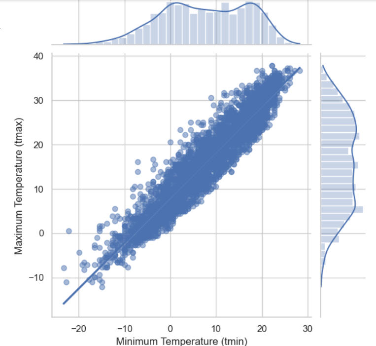

# Boston Weather Analysis 📊

## Problem Statement and Definition 🎯

The primary challenge this project seeks to address is the development of an accurate and reliable predictive model for Boston's weather conditions, leveraging historical data covering significant meteorological parameters from 2013 to 2023. This challenge is critical due to the direct impact of weather on public safety, transportation, energy consumption, and overall economic activities in the region. The project will explore various data mining techniques to forecast daily weather metrics such as temperature, precipitation, and wind patterns. Improving prediction accuracy is not merely a technical goal but a necessity to enhance urban planning, emergency preparedness, and resource management in the face of climate variability and change. By focusing on Boston, this study also contributes to understanding the broader implications of climate trends and the increasing frequency of extreme weather events, providing insights that are vital for future climate resilience strategies.

## Data Exploration 🖥️

We obtained the Boston weather dataset spanning from 2013 to 2023 from Kaggle. This dataset comprises the following columns: 

- **Date:** Represented in string format 
- **Average Temperature (tavg):** Recorded in Celsius, as a float 
- **Minimum Temperature (tmin):** Recorded in Celsius, as a float 
- **Maximum Temperature (tmax):** Recorded in Celsius, as a float 
- **Precipitation (prcp):** Daily total measured in millimeters, as a float 
- **Wind Direction (wdir):** Average direction in degrees, as a float 
- **Wind Speed (wspd):** Average speed in kilometers per hour, as a float 
- **Air Pressure (pres):** Average sea-level pressure in hectopascals, as a float 

## Data Preprocessing and Handling Missing Values 🧹

  

Our initial exploration revealed several important insights into the Boston weather dataset. Firstly, an examination of the first 10 rows provided a glimpse into its structure and contents. Secondly, detailed assessments using `df.info()` and `df.describe()` unveiled crucial information regarding data types, missing values, and statistical summaries. One notable observation was the presence of missing values in the 'tavg' column, prompting the decision to impute them by aligning with corresponding values from other columns. This meticulous approach ensured uniformity throughout the dataset. Moreover, to address missing values in the 'wdir' column, linear interpolation was employed, enhancing dataset completeness. Additionally, transforming the 'time' column into datetime format facilitated temporal analysis, with supplementary columns for year and month extraction further enhancing granularity. Lastly, preprocessing techniques like standardization and normalization were applied to standardize data across features, preparing it for subsequent analytical and modeling tasks. These comprehensive data processing steps underscore our commitment to ensuring the dataset's readiness for insightful exploration and meaningful interpretation of Boston's weather patterns.

## Exploratory Data Analysis

  

In the exploratory data analysis (EDA) of the Boston weather dataset, a comprehensive approach was adopted to understand the relationships between various meteorological parameters. A scatter plot with regression line analysis was conducted specifically to explore the connection between the minimum and maximum temperatures ('tmin' vs. 'tmax'). This analysis revealed insights into how changes in minimum temperatures might influence maximum temperatures, aiding in understanding temperature dynamics and weather patterns.

By analyzing the correlation matrix, we gained valuable insights into the interdependencies among meteorological parameters. For instance, we could identify which variables exhibited strong correlations, such as temperature and pressure, or wind speed and wind direction. These insights are crucial for understanding the complex interactions within the weather system and for informing further analysis and modeling efforts. Overall, the combined use of scatter plots, regression lines, pair plots, and correlation matrices provided a comprehensive framework for exploring the Boston weather dataset, enabling us to uncover patterns, relationships, and trends essential for understanding and predicting weather phenomena.

## Data Visualizations 📊

### Temperature Trends in Boston

  

The bar chart depicting temperature trends in Boston over the span of 2013 to 2023 offers a compelling narrative of the city's climatic oscillations. It showcases a cyclical pattern of temperature variation, with winter months, especially December through February, consistently registering sub-zero averages, while summer months, notably May through September, experience peaks surpassing 30 degrees Celsius. The chart's overarching trend line illustrates a gradual ascent from winter's icy grip to summer's warmth, followed by a gradual descent as the year draws to a close. This visualization serves as a valuable tool for stakeholders, providing insights crucial for urban planning, resource allocation, and climate adaptation strategies tailored to Boston's distinct seasonal rhythms.

### Yearly Trend in Average Wind Speed

  

The first line plot detailing the yearly trend in average wind speed in Boston from 2013 to 2023 offers a nuanced perspective on atmospheric dynamics. It commences at 16.5 mph in 2013, witnessing a slight uptick to 17 mph in 2014 before experiencing a discernible downturn. Notably, in 2017, there is a remarkable surge, with wind speeds peaking at approximately 20 mph, indicative of heightened atmospheric activity. Subsequent to this peak, another downturn is evident, particularly noticeable in 2021. Post-2021, the plot stabilizes around 17.5 mph, implying a return to more typical wind conditions, albeit slightly elevated compared to earlier years.

### Comparison of Actual vs. Calculated Average Temperature

This visualization illustrates a comparison between the actual average temperature (tavg) and the calculated average temperature across different seasons: Spring, Summer, Fall, and Winter. Each data point represents the mean temperature for the respective season. Notably, while the actual average temperature across all seasons is recorded as 9.04, the calculated average temperature is slightly higher at 9.3. The graph reveals interesting insights into the accuracy of the calculated average temperature in relation to the actual values across different seasons. In general, the calculated temperature closely aligns with the actual temperature trends, exhibiting similar fluctuations and patterns. However, there are slight discrepancies between the two, particularly evident in certain seasons. For instance, during the Fall season, the calculated average temperature tends to slightly exceed the actual temperature, indicating a potential overestimation. Conversely, in Spring and Winter, the calculated average temperature closely mirrors the actual temperature, suggesting a higher level of accuracy in these seasons. Overall, this visualization provides valuable insights into the effectiveness of the calculated average temperature in approximating the actual temperature trends across different seasons.

## Model Performance Evaluation 🚀

In this evaluation, we began by preparing our dataset, implementing various regression models, and assessing their performance metrics. The initial step involved creating a training dataset by shifting the 'tomavg' column and filling any missing values. Subsequently, we split the dataset into training and testing sets using a test size of 20%. Three regression models were then trained and evaluated:

1. Linear Regression
2. Random Forest Regressor
3. XGBoost Regressor

For each model, we computed key metrics including Mean Squared Error (MSE), R-squared, and Mean Absolute Error (MAE) to quantify their predictive accuracy. Visualizations such as bar plots were utilized to compare the performance of these models across different metrics. Through visualizations like scatter plots and histograms, we gained insights into the accuracy and distribution of predicted
